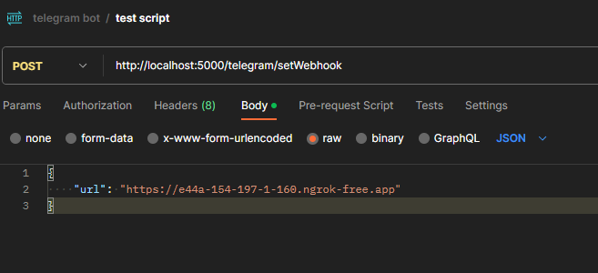

# Setup

We strongly recommend define the port number into the .env file. You can copy the .env.example file and rename it to .env. Then you can define the port number.

1. `npm install`

2. The project starts in development mode using the following command.
   `npm run dev`

3. Use ngrok to setup the webhook.
   `ngrok http 5000`

4. We recommend to use the postman extention to work as local host with the following link `https://marketplace.visualstudio.com/items?itemName=Postman.postman-for-vscode`.

5. Copy the ngrok url and set the webhook url using the route
   `/telegram/setWebhook`

# .env Setup

1. Search for our own telegram token on the Telegram documentation on the following link `https://core.telegram.org/bots#how-do-i-create-a-bot`

#### Example:

# Development

The project has some strict validations related to the coverage tests. You can only make a commit if the tests pass the minimum coverage. This will be very helpful to keep organized the code. Every commit should works, so if we want to revert any change, the application should not break, because everything has valid tests.

# Database

We use prisma as ORM. You must install it. https://www.prisma.io/
As requirement you need to install first Docker. You can install the following extension for VSCode:

Name: MySQL
Id: cweijan.vscode-mysql-client2
Description: Database manager for MySQL/MariaDB, PostgreSQL, SQLite, Redis and ElasticSearch.
Version: 6.7.0
Publisher: Weijan Chen
VS Marketplace Link: https://marketplace.visualstudio.com/items?itemName=cweijan.vscode-mysql-client2

- To run the database you need to execute the command `npm run init-db`.
- While running the database command, open another terminal and run `npx prisma migrate dev` to execute the migrations, and run the db seeders.
- To run the seeders manually execute `npx prisma db seed`. (optional)
- Inside the docker/docker-compose.yml file you can find the database configuration.
   